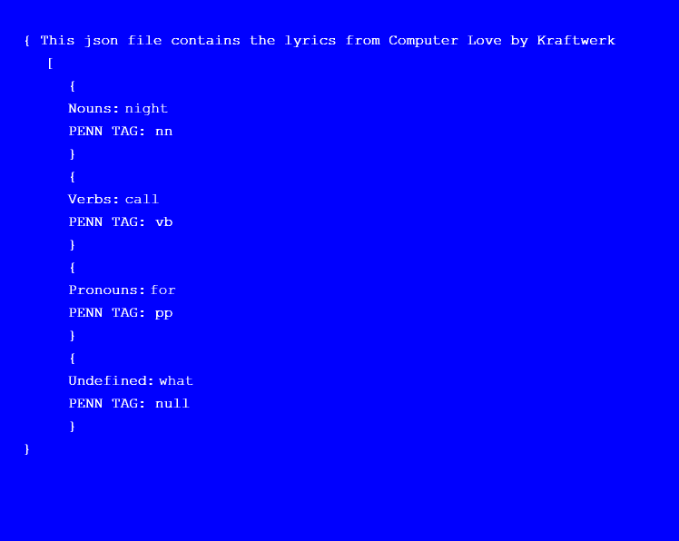

### C0MPUT3R L0V3 

By Sille Nygaard Kock and Thomas Thomsen

Link to the program: https://rawgit.com/SilleKock/mini_ex/master/mini_ex_7/empty-example/index.html

#### Each of you in the group analyze your own e-lit work by using the text'Vocable Code': what is the aesthetic aspects of your program in particular to the relationship between code and language?

* “'secondary notation',a pejorative term suggesting that code's primary purpose is to be executed by a computer, and only secondarily to be understood by a human.” *
